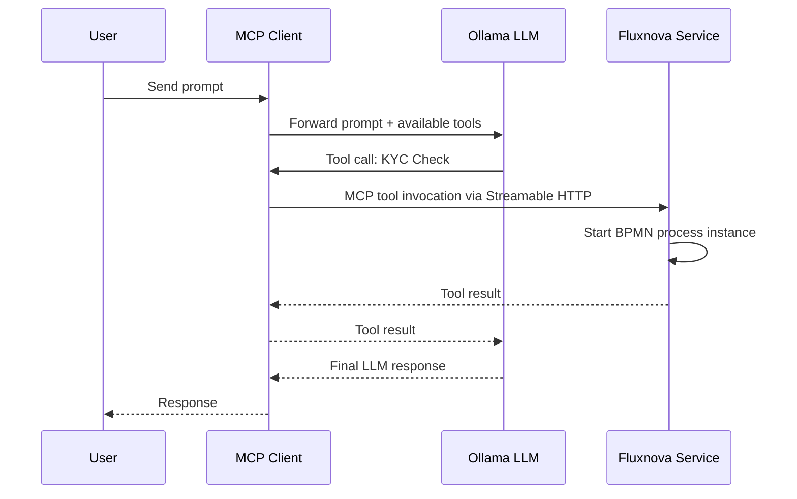

# Fluxnova AI MCP Start Event Demo

## Overview

*NB:* This README is based on an unmerged [PR](https://github.com/finos/fluxnova-ai/pull/14), so expect changes. This project will help test the PR.

This demo showcases the **Fluxnova AI MCP Start Event** feature, which allows BPMN processes to be exposed as [MCP (Model Context Protocol)](https://modelcontextprotocol.io/) tools. When an LLM receives a prompt, it can autonomously discover and invoke BPMN processes as tools via the MCP protocol.

The architecture uses **Spring AI MCP** to wire everything together:

- **fluxnova-service** — Runs the Fluxnova BPM engine with the MCP Start Event extension. BPMN processes with AI-enabled start events are automatically exposed as MCP tools.
- **mcp-client** — A Spring AI application that connects to an LLM (Ollama) and has fluxnova-service configured as an MCP tool provider. When a user sends a prompt, the LLM decides which tools to invoke. Standard Spring AI MCP implementation, nothing to see here related to Fluxnova
- **ollama** — Runs a local LLM model. This has nothing to do with Fluxnova — Standard Ollama implementation, nothing to see here related to Fluxnova.

> **Note:** `mcp-client` and `ollama` are **not Fluxnova components**. They exist in this demo only to simulate an existing MCP-enabled AI platform that discovers and calls Fluxnova tools.

We are using  Ollama **Qwen3 0.6B** model. This is a small, lightweight model that requires no external API keys or configuration. It is not powerful but is sufficient to demonstrate the MCP tool invocation flow. 

*NB: The ollama image is a 9GB download*

## Architecture



## Local Dependency

The `mcp-fluxnova-extension-0.1.0.jar` dependency has not yet been released to a public Maven repository. It is included in the `dependency/` folder and is automatically installed into the Maven local repository during the Docker build.

## Prerequisites

- Docker and Docker Compose
- [Fluxnova Modeller](https://github.com/finos/fluxnova-modeler) with the current version of the [MCP Tool Plugin](https://github.com/finos/fluxnova-ai/pull/14/commits/0d2e1c57a03ec606242c79dffa3771f2556fcc50). 
- (Optional) Node.js/npx for running the MCP Inspector

## Getting Started

Clone [Fluxnova Modeler](https://github.com/finos/fluxnova-modeler) and build it, and then place the whole [mcp-tool-plugin](https://github.com/finos/fluxnova-ai/pull/14/commits/0d2e1c57a03ec606242c79dffa3771f2556fcc50) inside modeler folder `resources\plugins`

Start all services:

```powershell
docker-compose down -v; docker-compose up --build
```

> **Warning:** On first startup, Docker will download the Qwen3 0.6B Ollama model (~9GB). Wait until the download completes before testing. You should see the following in the ollama logs:
>
> ```
> pulling 7f4030143c1c: 100% ▕██████████████████▏ 522 MB
> ...
> success
> ```

Once started, you should see three containers running:

| Container | Port | Description |
|---|---|---|
| `mcp-client` | [http://localhost:8083](http://localhost:8083) | Spring AI MCP Client + Ollama chat |
| `fluxnova-service` | [http://localhost:8084](http://localhost:8084) | Fluxnova BPM Engine + MCP Server |
| `ollama` | [http://localhost:11434](http://localhost:11434) | Ollama LLM runtime |

## Deployed Processes

Three BPMN processes are auto-deployed from `fluxnova-service/src/main/resources/processes/`:

| Process | File | MCP Enabled | Propagate Business Key |
|---|---|---|---|
| KYC Check | `kycCheck.bpmn` | Yes | No |
| Transaction History Check | `transactionHistoryCheck.bpmn` | Yes | Yes |
| LLM Invocation | `llmInvocation.bpmn` | No (orchestrator) | N/A |

## Fluxnova Monitoring

Log into the Fluxnova monitoring tool at:

**[http://localhost:8084/fluxnova/app/monitoring/](http://localhost:8084/fluxnova/app/monitoring/)**

Login: `demo` / `demo`

You should see the three deployed processes listed. After running the test cases, you can inspect process instances and their variables here.

## Verifying MCP Tools with Inspector (OPTIONAL)

You can verify that `fluxnova-service` correctly exposes MCP tools using the MCP Inspector:

```bash
npx @modelcontextprotocol/inspector
```

1. Change the **Transport Type** to `Streamable HTTP`
2. Set the **URL** to `http://localhost:8084/mcp`
3. Click **Connect**, then click **Tools** and **List Tools**
4. You should see the two deployed processes listed as tools

> You do not need to test tool invocation via the inspector — this is just to verify the tools are exposed.

## Fluxnova Modeler

The `fluxnova-modeler-1.1.1/` directory contains a pre-built Fluxnova Modeler with the **MCP Start Event Plugin** already installed - see `fluxnova-modeler-1.1.1/resources/plugins/mcp-tool-plugin`

Run it with:

```
fluxnova-modeler-1.1.1\Fluxnova Modeler.exe
```

You can use it to inspect the processes in `fluxnova-service/src/main/resources/processes/` and to create new AI-enabled processes. New processes can be **live-deployed via the modeler** — no restart required. Once deployed, they are immediately available as MCP tools.

---

## Test Cases

### Test Case 1: Simple MCP Tool Invocation (KYC Check)

This test demonstrates how a prompt sent to `mcp-client` causes the LLM to discover and invoke the KYC Check process as an MCP tool.

The `kycCheck.bpmn` process has an **AI-enabled start event** (`mcp:type="mcpToolStart"`). Note that **Propagate Business Key is not checked**, meaning the generated MCP tool does not expect a `businessKey` input parameter.

**Run the test** (also in `rest.http`) with prompt `perform kyc check for customer Foo Bar`:

```http
GET http://localhost:8083/chat?prompt=perform%20kyc%20check%20for%20customer%20Foo%20Bar
```

**Verify:** Log into [Monitoring Tool](http://localhost:8084/fluxnova/app/monitoring/) and check the `kycCheck` process. You should see a new process instance in the KYC process with the variables populated by the LLM.

### Test Case 2: Business Key Propagation (Transaction History Check)

This is a more advanced test that demonstrates how a **parent BPMN process can propagate a business key to child processes** started by the LLM. This enables full traceability — linking the main orchestration process to all BPMN AI tools that the LLM invoked via the Business Key.

The flow works as follows:

1. `llmInvocation.bpmn` is started via REST API with a `prompt` variable
2. A business key (UUID) is assigned to the process
3. The business key is injected into the prompt (note: this currently uses a simple `.concat()` approach — this can be abstracted in future iterations)
4. The prompt is sent to `mcp-client`, which forwards it to the LLM
5. The LLM invokes the `Transaction History Check` tool via MCP
6. Because **Propagate Business Key is checked** on `transactionHistoryCheck.bpmn` AI Start event, the tool includes a `businessKey` parameter, and the LLM passes the business key from the prompt

**Run the test** (also in `rest.http`):

```http
POST http://localhost:8084/engine-rest/process-definition/key/llm_invocation/start
Content-Type: application/json

{"variables":{"prompt":{"value":"Perform transaction history scanning for Foo Bar for 2025","type":"String"}}}
```

**Verify:** Log into [http://localhost:8084/fluxnova/app/monitoring/](http://localhost:8084/fluxnova/app/monitoring/):

- The `llmInvocation` process instance will have a **business key** (UUID)
- A `transactionHistoryCheck` process instance should have been started by the LLM with the **same business key**, linking the two processes together

This demonstrates end-to-end traceability: from the parent orchestration process through the LLM to the child BPMN tool invocations.
