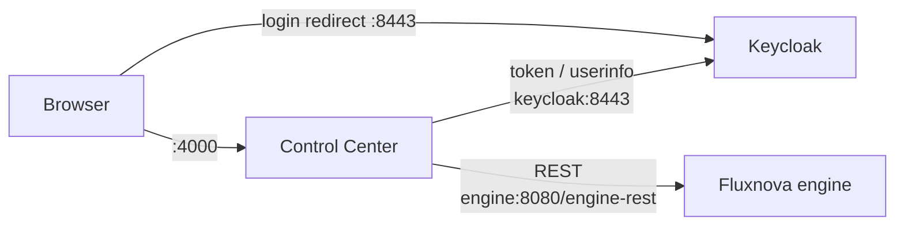

# Fluxnova with Control Center example

This example runs a local Fluxnova stack with a single command:

| Service          | Image                                 | URL                                          |
|------------------|---------------------------------------|----------------------------------------------|
| `keycloak`       | `quay.io/keycloak/keycloak:26.7`      | https://localhost:8443 (admin console)       |
| `engine`         | `finos/fluxnova-bpm-platform:3.0.0`   | http://localhost:8080 (webapps and REST API) |
| `control-center` | `finos/fluxnova-control-center:1.2.0` | https://localhost:4000                       |

A one-shot `certs` service creates a self-signed certificate on first start. Keycloak and the
Control Center share it. You only need Docker on the host.



## Prerequisites

- Docker Desktop, or Docker Engine with the Compose plugin
- Free ports: `4000`, `8080`, `8443`

## Run

From this directory:

```sh
docker compose up -d
docker compose ps
```

The first start takes a minute or two while the images are pulled and the engine deploys its
bundled invoice example.

## Use

1. Open https://localhost:8443 once and accept the self-signed certificate warning. If you skip
   this, the browser may block the login redirect later.
2. Open https://localhost:4000, accept the certificate warning again, and sign in with one of the
   users below.

Users from `keycloak/fluxnova-realm.json`:

| User    | Password | Groups                                               |
|---------|----------|------------------------------------------------------|
| `demo`  | `demo`   | `sales`, `accounting`, `management`, `fluxnova-admin` |
| `john`  | `john`   | `sales`                                              |
| `mary`  | `mary`   | `accounting`                                         |
| `peter` | `peter`  | `management`                                         |

To manage the realm, open the Keycloak admin console at https://localhost:8443 and sign in as
`admin` / `admin`.

The engine's own webapps (Cockpit, Tasklist, Admin) are at http://localhost:8080, with login
`demo` / `demo`. These use the engine's own users, not Keycloak.

## Configuration

Image versions and credentials can be overridden with environment variables or a `.env` file
next to `docker-compose.yml`:

| Variable                          | Default                  |
|-----------------------------------|--------------------------|
| `FLUXNOVA_ENGINE_VERSION`         | `3.0.0`                  |
| `FLUXNOVA_CONTROL_CENTER_VERSION` | `1.2.0`                  |
| `KEYCLOAK_VERSION`                | `26.7`                   |
| `KEYCLOAK_ADMIN_USER`             | `admin`                  |
| `KEYCLOAK_ADMIN_PASSWORD`         | `admin`                  |
| `FXN_OIDC_CLIENT_SECRET`          | `control-center-secret`  |
| `FXN_COOKIE_KEYS`                 | `change-me-cookie-key`   |
| `FXN_CSRF_KEY`                    | `change-me-csrf-key`     |
| `FXN_LOG_LEVEL`                   | `info`                   |

If you change `FXN_OIDC_CLIENT_SECRET`, also change the client `secret` in
`keycloak/fluxnova-realm.json`. Keycloak imports the realm only when it does not already exist,
so after editing the realm file run `docker compose down` and then `docker compose up -d` again.

See the [Control Center configuration reference](https://github.com/finos/fluxnova-control-center/blob/main/docs/reference/configuration.md)
for every `FXN_*` option.

## How the hostnames fit together

The browser reaches Keycloak at `localhost:8443`, and the Control Center container reaches it at
`keycloak:8443`. Keycloak is started with `KC_HOSTNAME=https://localhost:8443`, so every token
carries the issuer `https://localhost:8443/realms/fluxnova` whichever hostname was used to request
it. That is why:

- `FXN_OIDC_AUTH_URL` (a browser redirect) uses `localhost`
- `FXN_OIDC_TOKEN_URL` and `FXN_OIDC_USERINFO_URL` (server-to-server calls) use `keycloak`
- `FXN_OIDC_ISSUER` uses `localhost`, to match the token

The certificate covers `localhost`, `keycloak` and `control-center`. The Control Center trusts it
through `NODE_EXTRA_CA_CERTS`.

## Known limitations

- **The engine REST API is not authenticated.** Keycloak protects the Control Center UI only. The
  published `fluxnova-bpm-platform` image (Fluxnova Run) supports HTTP Basic authentication for
  the REST API, but it does not expose the engine's JWT authentication provider through
  configuration, so it cannot validate Keycloak tokens. Port `8080` is therefore bound to
  `127.0.0.1` only, and the Control Center reaches the engine over the internal compose network.
- The engine uses an embedded H2 database inside its container, so process data is lost when the
  container is removed.
- The certificate is self-signed and valid for 365 days. Browsers show a warning for it.

None of this setup is suitable for production.

## Troubleshooting

View the logs:

```sh
docker compose logs -f control-center
docker compose logs -f keycloak
docker compose logs -f engine
```

- **`msal callback error` after login:** usually an issuer mismatch. Check that `FXN_OIDC_ISSUER`
  matches the `iss` claim, which is `https://localhost:8443/realms/fluxnova` unless you changed
  `KC_HOSTNAME`.
- **Keycloak shows "Invalid parameter: redirect_uri":** the Control Center URL must match the
  client's `redirectUris` in `keycloak/fluxnova-realm.json`.
- **Behind a corporate proxy:** the compose file clears `HTTP(S)_PROXY` for the Control Center,
  because a proxy breaks container-to-container calls. If the `certs` job cannot reach the Alpine
  package mirror, pass the proxy to it, or generate `fluxnova-local.crt` and `fluxnova-local.key`
  yourself and copy them into the `certs` volume.

## Stop

```sh
docker compose down      # stop and remove the containers
docker compose down -v   # also remove the generated certificate
```
